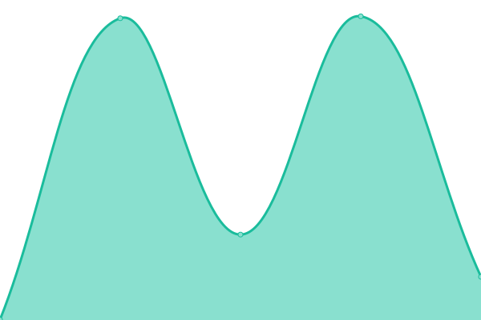

# [📈 Live Status](https://demo.upptime.js.org): <!--live status--> **🟩 All systems operational**

This repository contains the open-source uptime monitor and status page for [디지털헤럴드](https://dherald.com), powered by [Upptime](https://github.com/upptime/upptime).

With [Upptime](https://upptime.js.org), you can get your own unlimited and free uptime monitor and status page, powered entirely by a GitHub repository. We use [Issues](https://github.com/dherald/service-status/issues) as incident reports, [Actions](https://github.com/dherald/service-status/actions) as uptime monitors, and [Pages](https://demo.upptime.js.org) for the status page.

<!--start: status pages-->
<!-- This summary is generated by Upptime (https://github.com/upptime/upptime) -->
<!-- Do not edit this manually, your changes will be overwritten -->
<!-- prettier-ignore -->
| URL | Status | History | Response Time | Uptime |
| --- | ------ | ------- | ------------- | ------ |
|  [롤 전적 검색 딥롤](https://www.deeplol.gg) | 🟩 Up | [.yml](https://github.com/dherald/service-status/commits/HEAD/history/.yml) | 

 721ms
     
 | 

<a href="https://dherald.github.io/service-status/history/">100.00%</a>
    

|  [DEEPLOL PRO](https://pro.deeplol.gg) | 🟩 Up | [deeplol-pro.yml](https://github.com/dherald/service-status/commits/HEAD/history/deeplol-pro.yml) | 

 690ms
     
 | 

<a href="https://dherald.github.io/service-status/history/deeplol-pro">100.00%</a>
    

|  [서강대학교 경영전문대학원 온라인 단기 MBA](https://sogang.dherald.com) | 🟩 Up | [mba.yml](https://github.com/dherald/service-status/commits/HEAD/history/mba.yml) | 

 740ms
     
 | 

<a href="https://dherald.github.io/service-status/history/mba">100.00%</a>
    

|  [한국외국어대학교 경영대학원 bfMBA](https://bfmba.ac.kr/) | 🟩 Up | [bf-mba.yml](https://github.com/dherald/service-status/commits/HEAD/history/bf-mba.yml) | 

 877ms
     
 | 

<a href="https://dherald.github.io/service-status/history/bf-mba">100.00%</a>
    

|  [아주대학교 공공정책대학원 MPA](https://ajoumpa.ac.kr/) | 🟩 Up | [mpa.yml](https://github.com/dherald/service-status/commits/HEAD/history/mpa.yml) | 

 882ms
     
 | 

<a href="https://dherald.github.io/service-status/history/mpa">100.00%</a>
    

|  [프렌치마스터](https://frenchmaster.co.kr) | 🟩 Up | [.yml](https://github.com/dherald/service-status/commits/HEAD/history/.yml) | 

 721ms
     
 | 

<a href="https://dherald.github.io/service-status/history/">100.00%</a>
    

|  [일어마스터](https://japanesemaster.co.kr/) | 🟩 Up | [.yml](https://github.com/dherald/service-status/commits/HEAD/history/.yml) | 

 721ms
     
 | 

<a href="https://dherald.github.io/service-status/history/">100.00%</a>
    

|  [AI & Big Data Education Center](https://abedu.co.kr/) | 🟩 Up | [ai-and-big-data-education-center.yml](https://github.com/dherald/service-status/commits/HEAD/history/ai-and-big-data-education-center.yml) | 

 825ms
     
 | 

<a href="https://dherald.github.io/service-status/history/ai-and-big-data-education-center">100.00%</a>
    

|  [아나운서 코치](https://announcercoach.co.kr/) | 🟩 Up | [.yml](https://github.com/dherald/service-status/commits/HEAD/history/.yml) | 

 721ms
     
 | 

<a href="https://dherald.github.io/service-status/history/">100.00%</a>
    

|  [미국 고등 검정고시 GED 공식 교육 센터](https://gedpass.co.kr/) | 🟩 Up | [ged.yml](https://github.com/dherald/service-status/commits/HEAD/history/ged.yml) | 

 848ms
     
 | 

<a href="https://dherald.github.io/service-status/history/ged">100.00%</a>
    

|  [통대닷컴](https://tongdae.com/) | 🟩 Up | [.yml](https://github.com/dherald/service-status/commits/HEAD/history/.yml) | 

 721ms
     
 | 

<a href="https://dherald.github.io/service-status/history/">100.00%</a>
    

|  [헤럴드이프렙](https://heraldeprep.com/) | 🟩 Up | [.yml](https://github.com/dherald/service-status/commits/HEAD/history/.yml) | 

 721ms
     
 | 

<a href="https://dherald.github.io/service-status/history/">100.00%</a>
    

|  [헤럴드해외취업센터 K-Move](https://heraldjob.com/) | 🟩 Up | [k-move.yml](https://github.com/dherald/service-status/commits/HEAD/history/k-move.yml) | 

 167ms
     
 | 

<a href="https://dherald.github.io/service-status/history/k-move">100.00%</a>
    

|  [KTIGERS](https://ktigers.org/) | 🟩 Up | [ktigers.yml](https://github.com/dherald/service-status/commits/HEAD/history/ktigers.yml) | 

 805ms
     
 | 

<a href="https://dherald.github.io/service-status/history/ktigers">100.00%</a>
    

|  [PTE Pass 공식 교육센터](https://ptepass.co.kr/) | 🟩 Up | [pte-pass.yml](https://github.com/dherald/service-status/commits/HEAD/history/pte-pass.yml) | 

 844ms
     
 | 

<a href="https://dherald.github.io/service-status/history/pte-pass">100.00%</a>
    

|  [코리아헤럴드학원](https://heraldstudy.com/) | 🟩 Up | [.yml](https://github.com/dherald/service-status/commits/HEAD/history/.yml) | 

 721ms
     
 | 

<a href="https://dherald.github.io/service-status/history/">100.00%</a>
    

|  [코리아헤럴드통번역센터](https://heraldtrans.com/) | 🟩 Up | [.yml](https://github.com/dherald/service-status/commits/HEAD/history/.yml) | 

 721ms
     
 | 

<a href="https://dherald.github.io/service-status/history/">100.00%</a>
    

|  [HIS 헤럴드교육센터](https://hisacademy.co.kr/) | 🟩 Up | [his.yml](https://github.com/dherald/service-status/commits/HEAD/history/his.yml) | 

 605ms
     
 | 

<a href="https://dherald.github.io/service-status/history/his">100.00%</a>
    

|  [HIS BOOKS](https://hisbook.co.kr/) | 🟩 Up | [his-books.yml](https://github.com/dherald/service-status/commits/HEAD/history/his-books.yml) | 

 995ms
     
 | 

<a href="https://dherald.github.io/service-status/history/his-books">100.00%</a>
    

|  [PTE Academic 공식 시험센터](https://herald.ptea.co.kr/) | 🟩 Up | [pte-academic.yml](https://github.com/dherald/service-status/commits/HEAD/history/pte-academic.yml) | 

 811ms
     
 | 

<a href="https://dherald.github.io/service-status/history/pte-academic">100.00%</a>
    

|  [HIS 헤럴드교육센터](https://hisacademy.co.kr/) | 🟩 Up | [his.yml](https://github.com/dherald/service-status/commits/HEAD/history/his.yml) | 

 605ms
     
 | 

<a href="https://dherald.github.io/service-status/history/his">100.00%</a>
    

<!--end: status pages-->

[**Visit our status website →**](https://dherald.github.io/service-status/)

## 📄 License

- Powered by: [Upptime](https://github.com/upptime/upptime)
- Code: [MIT](./LICENSE) © [디지털헤럴드](https://dherald.com)
- Data in the `./history` directory: [Open Database License](https://opendatacommons.org/licenses/odbl/1-0/)
