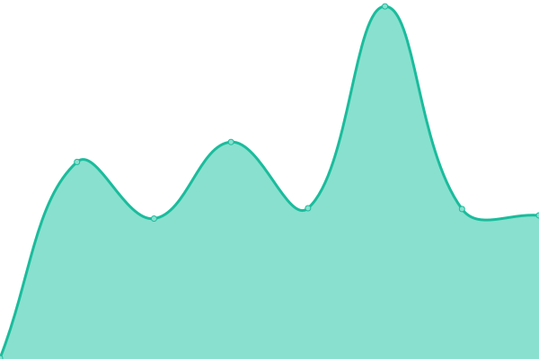
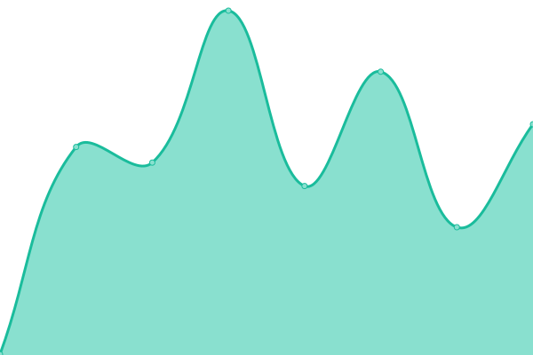
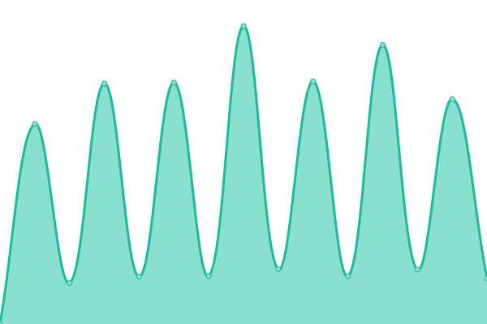

# [📈 Live Status](https://demo.upptime.js.org): <!--live status--> **🟩 All systems operational**

This repository contains the open-source uptime monitor and status page for [디지털헤럴드](https://dherald.com), powered by [Upptime](https://github.com/upptime/upptime).

With [Upptime](https://upptime.js.org), you can get your own unlimited and free uptime monitor and status page, powered entirely by a GitHub repository. We use [Issues](https://github.com/dherald/service-status/issues) as incident reports, [Actions](https://github.com/dherald/service-status/actions) as uptime monitors, and [Pages](https://demo.upptime.js.org) for the status page.

<!--start: status pages-->
<!-- This summary is generated by Upptime (https://github.com/upptime/upptime) -->
<!-- Do not edit this manually, your changes will be overwritten -->
<!-- prettier-ignore -->
| URL | Status | History | Response Time | Uptime |
| --- | ------ | ------- | ------------- | ------ |
|  [www.deeplol.gg](https://www.deeplol.gg) | 🟩 Up | [www-deeplol-gg.yml](https://github.com/dherald/service-status/commits/HEAD/history/www-deeplol-gg.yml) | 

 225ms
     
 | 

<a href="https://dherald.github.io/service-status/history/www-deeplol-gg">100.00%</a>
    

|  [b2c-api.deeplol.gg](https://b2c-api.deeplol.gg/live) | 🟩 Up | [b2c-api-deeplol-gg.yml](https://github.com/dherald/service-status/commits/HEAD/history/b2c-api-deeplol-gg.yml) | 

 2502ms
     
 | 

<a href="https://dherald.github.io/service-status/history/b2c-api-deeplol-gg">99.69%</a>
    

|  [pro.deeplol.gg](https://pro.deeplol.gg) | 🟩 Up | [pro-deeplol-gg.yml](https://github.com/dherald/service-status/commits/HEAD/history/pro-deeplol-gg.yml) | 

 839ms
     
 | 

<a href="https://dherald.github.io/service-status/history/pro-deeplol-gg">100.00%</a>
    

|  [sogang.dherald.com](https://sogang.dherald.com) | 🟩 Up | [sogang-dherald-com.yml](https://github.com/dherald/service-status/commits/HEAD/history/sogang-dherald-com.yml) | 

 873ms
     
 | 

<a href="https://dherald.github.io/service-status/history/sogang-dherald-com">100.00%</a>
    

|  [bfmba.ac.kr](https://bfmba.ac.kr/) | 🟩 Up | [bfmba-ac-kr.yml](https://github.com/dherald/service-status/commits/HEAD/history/bfmba-ac-kr.yml) | 

 1654ms
     
 | 

<a href="https://dherald.github.io/service-status/history/bfmba-ac-kr">100.00%</a>
    

|  [ajoumpa.ac.kr](https://ajoumpa.ac.kr/) | 🟩 Up | [ajoumpa-ac-kr.yml](https://github.com/dherald/service-status/commits/HEAD/history/ajoumpa-ac-kr.yml) | 

 956ms
     
 | 

<a href="https://dherald.github.io/service-status/history/ajoumpa-ac-kr">100.00%</a>
    

|  [frenchmaster.co.kr](https://frenchmaster.co.kr) | 🟩 Up | [frenchmaster-co-kr.yml](https://github.com/dherald/service-status/commits/HEAD/history/frenchmaster-co-kr.yml) | 

 1241ms
     
 | 

<a href="https://dherald.github.io/service-status/history/frenchmaster-co-kr">100.00%</a>
    

|  [japanesemaster.co.kr](https://japanesemaster.co.kr/) | 🟩 Up | [japanesemaster-co-kr.yml](https://github.com/dherald/service-status/commits/HEAD/history/japanesemaster-co-kr.yml) | 

 936ms
     
 | 

<a href="https://dherald.github.io/service-status/history/japanesemaster-co-kr">100.00%</a>
    

|  [abedu.co.kr](https://abedu.co.kr/) | 🟩 Up | [abedu-co-kr.yml](https://github.com/dherald/service-status/commits/HEAD/history/abedu-co-kr.yml) | 

 924ms
     
 | 

<a href="https://dherald.github.io/service-status/history/abedu-co-kr">100.00%</a>
    

|  [announcercoach.co.kr](https://announcercoach.co.kr/) | 🟩 Up | [announcercoach-co-kr.yml](https://github.com/dherald/service-status/commits/HEAD/history/announcercoach-co-kr.yml) | 

 899ms
     
 | 

<a href="https://dherald.github.io/service-status/history/announcercoach-co-kr">100.00%</a>
    

|  [gedpass.co.kr](https://gedpass.co.kr/) | 🟩 Up | [gedpass-co-kr.yml](https://github.com/dherald/service-status/commits/HEAD/history/gedpass-co-kr.yml) | 

 929ms
     
 | 

<a href="https://dherald.github.io/service-status/history/gedpass-co-kr">100.00%</a>
    

|  [tongdae.com](https://tongdae.com/) | 🟩 Up | [tongdae-com.yml](https://github.com/dherald/service-status/commits/HEAD/history/tongdae-com.yml) | 

 672ms
     
 | 

<a href="https://dherald.github.io/service-status/history/tongdae-com">100.00%</a>
    

|  [heraldeprep.com](https://heraldeprep.com/) | 🟩 Up | [heraldeprep-com.yml](https://github.com/dherald/service-status/commits/HEAD/history/heraldeprep-com.yml) | 

 683ms
     
 | 

<a href="https://dherald.github.io/service-status/history/heraldeprep-com">100.00%</a>
    

|  [heraldjob.com](https://heraldjob.com/) | 🟩 Up | [heraldjob-com.yml](https://github.com/dherald/service-status/commits/HEAD/history/heraldjob-com.yml) | 

 279ms
     
 | 

<a href="https://dherald.github.io/service-status/history/heraldjob-com">100.00%</a>
    

|  [ktigers.org](https://ktigers.org/) | 🟩 Up | [ktigers-org.yml](https://github.com/dherald/service-status/commits/HEAD/history/ktigers-org.yml) | 

 760ms
     
 | 

<a href="https://dherald.github.io/service-status/history/ktigers-org">100.00%</a>
    

|  [ptepass.co.kr](https://ptepass.co.kr/) | 🟩 Up | [ptepass-co-kr.yml](https://github.com/dherald/service-status/commits/HEAD/history/ptepass-co-kr.yml) | 

 904ms
     
 | 

<a href="https://dherald.github.io/service-status/history/ptepass-co-kr">100.00%</a>
    

|  [heraldstudy.com](https://heraldstudy.com/) | 🟩 Up | [heraldstudy-com.yml](https://github.com/dherald/service-status/commits/HEAD/history/heraldstudy-com.yml) | 

 855ms
     
 | 

<a href="https://dherald.github.io/service-status/history/heraldstudy-com">100.00%</a>
    

|  [heraldtrans.com](https://heraldtrans.com/) | 🟩 Up | [heraldtrans-com.yml](https://github.com/dherald/service-status/commits/HEAD/history/heraldtrans-com.yml) | 

 737ms
     
 | 

<a href="https://dherald.github.io/service-status/history/heraldtrans-com">100.00%</a>
    

|  [hisacademy.co.kr](https://hisacademy.co.kr/) | 🟩 Up | [hisacademy-co-kr.yml](https://github.com/dherald/service-status/commits/HEAD/history/hisacademy-co-kr.yml) | 

 670ms
     
 | 

<a href="https://dherald.github.io/service-status/history/hisacademy-co-kr">100.00%</a>
    

|  [hisbook.co.kr](https://hisbook.co.kr/) | 🟩 Up | [hisbook-co-kr.yml](https://github.com/dherald/service-status/commits/HEAD/history/hisbook-co-kr.yml) | 

 1131ms
     
 | 

<a href="https://dherald.github.io/service-status/history/hisbook-co-kr">100.00%</a>
    

|  [herald.ptea.co.kr](https://herald.ptea.co.kr/) | 🟩 Up | [herald-ptea-co-kr.yml](https://github.com/dherald/service-status/commits/HEAD/history/herald-ptea-co-kr.yml) | 

 910ms
     
 | 

<a href="https://dherald.github.io/service-status/history/herald-ptea-co-kr">100.00%</a>
    

|  [hisacademy.co.kr](https://hisacademy.co.kr/) | 🟩 Up | [hisacademy-co-kr.yml](https://github.com/dherald/service-status/commits/HEAD/history/hisacademy-co-kr.yml) | 

 670ms
     
 | 

<a href="https://dherald.github.io/service-status/history/hisacademy-co-kr">100.00%</a>
    

|  [heraldinsight.co.kr](http://heraldinsight.co.kr/) | 🟩 Up | [heraldinsight-co-kr.yml](https://github.com/dherald/service-status/commits/HEAD/history/heraldinsight-co-kr.yml) | 

 1434ms
     
 | 

<a href="https://dherald.github.io/service-status/history/heraldinsight-co-kr">100.00%</a>
    

|  [heraldtomorrow.co.kr](http://heraldtomorrow.co.kr/) | 🟩 Up | [heraldtomorrow-co-kr.yml](https://github.com/dherald/service-status/commits/HEAD/history/heraldtomorrow-co-kr.yml) | 

 1470ms
     
 | 

<a href="https://dherald.github.io/service-status/history/heraldtomorrow-co-kr">100.00%</a>
    

<!--end: status pages-->

[**Visit our status website →**](https://dherald.github.io/service-status/)

## 📄 License

- Powered by: [Upptime](https://github.com/upptime/upptime)
- Code: [MIT](./LICENSE) © [디지털헤럴드](https://dherald.com)
- Data in the `./history` directory: [Open Database License](https://opendatacommons.org/licenses/odbl/1-0/)
